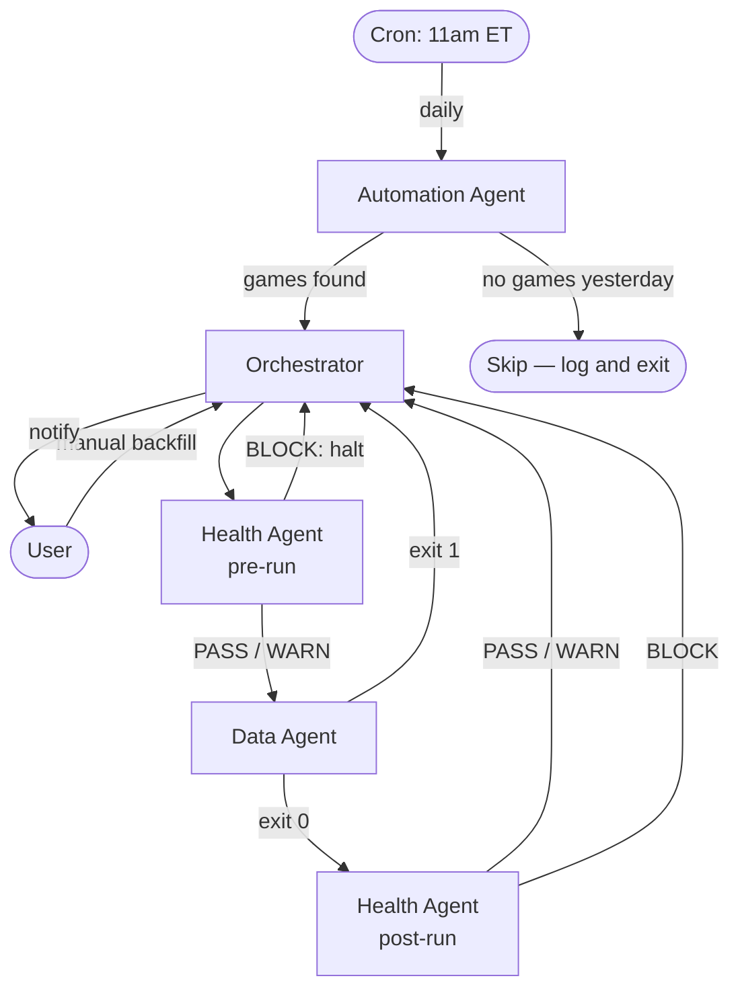

# Architecture

## Pipeline Modes

Two ways to run the pipeline:

| Mode | Trigger | What it does |
|---|---|---|
| **Daily automated** | Automation Agent cron at 11am ET | Checks NBA scoreboard for yesterday's Final games — skips if no games were played. Runs full pipeline on any games found. |
| **Historical backfill** | Manual (`--season 2023-24`) | Fetches all games for a season (regular season + playoffs). CDN available from 2019-20 onward. |

## Agent Coordination



## Data Flow

```mermaid
flowchart LR
    SCORE[CDN scoreboard\ntodaysScoreboard_00.json] -->|check Final games| AUTO[Automation Agent]
    AUTO --> ORC[Orchestrator]

    ORC --> DA[Data Agent]
    PBP[CDN play-by-play\nplaybyplay_{game_id}.json] --> DA
    BOX[CDN boxscore\nboxscore_{game_id}.json] --> DA

    DA -->|foul events| FE[(foul_events)]
    DA -->|game metadata| GM[(games)]
    DA -->|player registry| PL[(players)]
    DA -->|referee registry| REF[(referees)]
    DA -->|transform errors| LOG[error_log.jsonl]
    DA -->|run summary| LAST[last_run.json]
```

## Run Sequence

Every pipeline run executes in this order:

1. **Health Agent (pre-run)** — verify schemas, DB, and CDN are ready. Halt on BLOCK.
2. **Data Agent** — fetch play-by-play + boxscore, transform foul events, write to SQLite.
3. **Health Agent (post-run)** — check error rates and data quality. WARN continues; BLOCK halts.
4. **Orchestrator** — compile report, send macOS notification, write `last_orchestrator_run.json`.

## Key Decisions

| Decision | Choice | Reason |
|---|---|---|
| API endpoint | `cdn.nba.com` | `stats.nba.com` blocks programmatic access; CDN is public and fast |
| Referee identification | `officialId` in play-by-play → boxscore lookup | Direct field — no parsing required |
| Fouled player | `foulDrawnPersonId` / `foulDrawnPlayerName` | Direct fields — no parsing required |
| Foul categorization | `foul_detail` parsed from `description` | Only field requiring text parsing; 7 categories |
| Team fouls | Excluded, logged as known category | No player attribution — not useful for referee-player analysis |
| Double technicals | Logged as errors (no `officialId`) | Known CDN edge case; ~0.17% error rate, acceptable |
| Database | SQLite | Simple, zero-dependency, sufficient for current scale |
| Historical data | 2019-20 through 2025-26 | CDN confirmed available for these 7 seasons; older seasons not available |
| Scheduling | macOS cron at 11am ET | Runs after overnight games are finalized |

## CDN Endpoints

| Endpoint | URL Pattern |
|---|---|
| Play-by-play | `https://cdn.nba.com/static/json/liveData/playbyplay/playbyplay_{game_id}.json` |
| Boxscore | `https://cdn.nba.com/static/json/liveData/boxscore/boxscore_{game_id}.json` |
| Scoreboard | `https://cdn.nba.com/static/json/liveData/scoreboard/todaysScoreboard_00.json` |

## Game ID Format

| Type | Format | Example |
|---|---|---|
| Playoffs | `004{YY}{round}{series}{game}` | `0042500164` = 2025-26, round 1, series 6, game 4 |
| Regular season | `002{YY}{game_number}` | `0022300001` = 2023-24, game 1 |

## Future Scope

- Live game tracking (real-time play-by-play during games)
- English Premier League referee tracking
- 3D social network visualization: referees ↔ players connected by foul events
